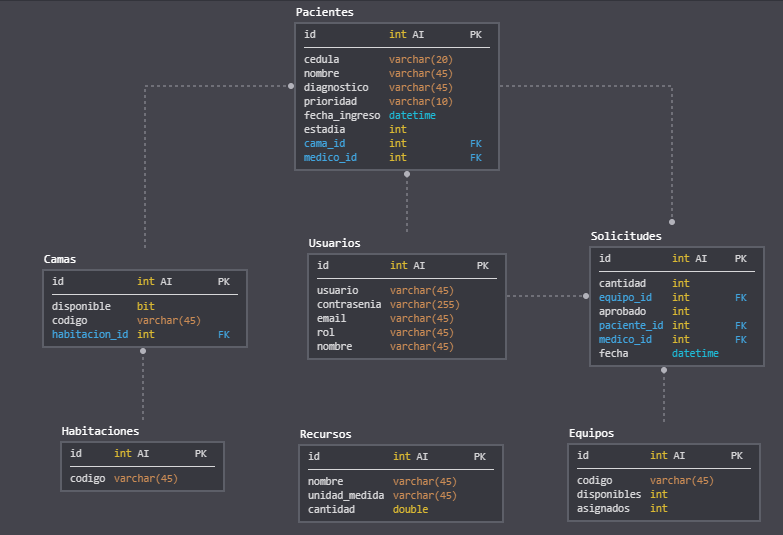

# ProyectoPHP
Gestor de un hospital implementado en PHP para la materia de Programación en la Web.

## Estructura del proyecto
* **config**: archivos de configuración de la base de datos en MySQL y declaración de constantes
* **src**: codigo fuente de la aplicación, la aplicación posee una arquitectura de N-Capas

## Modelo de la base de datos
La siguiente imagen muestra el esquema de la base de datos relacional empleada:

## Configurar correo en XAMPP
1. Abrir archivo php.ini
2. Buscar mail function
3. Asignar y descomentar los siguientes campos:
* SMTP=smtp.gmail.com
* smtp_port=587
* sendmail_from = **correo_emisor@gmail.com**
* sendmail_path = "\\"C:\xampp\sendmail\sendmail.exe\" -t"
4. Ir al archivo xampp/sendmail/sendmail.ini
5. Asignar los siguientes campos:
* smtp_server=smtp.gmail.com
* smtp_port=587
* auth_username= **correo_emisor@gmail.com**
* auth_password= **contraseña**
* force_sender= **correo_emisor@gmail.com**
